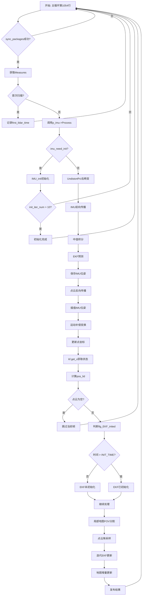

# FAST-LIO2 IMU预积分与运动补偿深度解析

## 📚 目录

1. [代码片段总览](#代码片段总览)
2. [逐行详细讲解](#逐行详细讲解)
3. [核心数据结构深度解析](#核心数据结构深度解析)
4. [IMU预积分数学原理](#imu预积分数学原理)
5. [运动补偿算法详解](#运动补偿算法详解)
6. [误差状态卡尔曼滤波(ESKF)原理](#误差状态卡尔曼滤波原理)
7. [坐标系变换与外参标定](#坐标系变换与外参标定)
8. [完整流程图](#完整流程图)

---

## 代码片段总览

```cpp
// 步骤2: IMU预积分和运动补偿
// 功能：利用IMU数据对点云进行去畸变，得到同一时刻的点云
p_imu->Process(Measures, kf, feats_undistort);
state_point = kf.get_x();  // 获取EKF估计的当前状态
pos_lid = state_point.pos + state_point.rot * state_point.offset_T_L_I;  // 雷达在世界系的位置

if (feats_undistort->empty() || (feats_undistort == NULL))
{
    ROS_WARN("No point, skip this scan!\n");
    continue;
}

// EKF初始化标志（需要等待INIT_TIME秒）
flg_EKF_inited = (Measures.lidar_beg_time - first_lidar_time) < INIT_TIME ? \
                false : true;
```

**代码位置**：`src/FAST_LIO/src/laserMapping.cpp` 主循环中的第1074-1088行

**核心功能**：这段代码是FAST-LIO2算法的**核心预处理步骤**，负责：
1. 利用IMU高频数据对点云进行去畸变
2. 更新系统状态估计
3. 计算雷达在世界坐标系中的位置
4. 判断EKF是否完成初始化

---

## 逐行详细讲解

### 第1行：核心处理函数调用

```cpp
p_imu->Process(Measures, kf, feats_undistort);
```

#### 变量详解

##### `p_imu`
- **类型**：`shared_ptr<ImuProcess>`
- **定义位置**：第152行 `shared_ptr<ImuProcess> p_imu(new ImuProcess());`
- **作用**：IMU处理器的智能指针，管理IMU数据处理和点云去畸变的核心逻辑

##### `Measures`
- **类型**：`MeasureGroup`（测量组结构体）
- **定义**：在`common_lib.h`中定义
```cpp
struct MeasureGroup     // LiDAR数据与IMU数据的同步组
{
    double lidar_beg_time;                      // 雷达扫描开始时间（秒）
    double lidar_end_time;                      // 雷达扫描结束时间（秒）
    PointCloudXYZI::Ptr lidar;                  // 原始点云数据（带畸变）
    deque<sensor_msgs::ImuConstPtr> imu;        // 该帧对应的IMU数据队列
};
```
- **数据来源**：由`sync_packages()`函数从缓冲区中同步LiDAR和IMU数据
- **关键特点**：
  - `imu`队列包含了从上一帧LiDAR结束到当前帧结束之间的所有IMU数据
  - 确保IMU数据完整覆盖整个LiDAR扫描周期（通常100-200ms）

##### `kf`
- **类型**：`esekfom::esekf<state_ikfom, 12, input_ikfom>`
- **定义位置**：第142行
- **全称**：Error-State Extended Kalman Filter on Manifolds（流形上的误差状态扩展卡尔曼滤波器）
- **模板参数详解**：
  - `state_ikfom`：23维状态向量（详见后文）
  - `12`：过程噪声维度
  - `input_ikfom`：6维输入向量（3D加速度 + 3D角速度）

##### `feats_undistort`
- **类型**：`PointCloudXYZI::Ptr`（点云智能指针）
- **定义位置**：第120行 `PointCloudXYZI::Ptr feats_undistort(new PointCloudXYZI());`
- **用途**：存储**去畸变后**的点云数据
- **重要性**：去畸变是激光SLAM的关键步骤，将运动过程中采集的点统一到同一时刻

#### Process()函数深度解析

**函数签名**：
```cpp
void ImuProcess::Process(
    const MeasureGroup &meas,                               // 输入：同步的测量组
    esekfom::esekf<state_ikfom, 12, input_ikfom> &kf_state, // 输入输出：卡尔曼滤波器
    PointCloudXYZI::Ptr cur_pcl_un_                        // 输出：去畸变点云
)
```

**完整执行流程**：

##### 阶段1：IMU初始化（前10帧）
```cpp
if (imu_need_init_)
{
    IMU_init(meas, kf_state, init_iter_num);
    // ...
    if (init_iter_num > MAX_INI_COUNT)  // MAX_INI_COUNT = 10
    {
        imu_need_init_ = false;
        // 初始化完成
    }
    return;
}
```

**初始化目标**：
1. **估计重力方向**：
   - 假设：初始时刻载体静止
   - 方法：对加速度计测量取平均
   - 数学模型：$\mathbf{a}_{measured} = -\mathbf{g}_{world}$（静止时，加速度计测量值为重力的反向）
   - 实现：
   ```cpp
   init_state.grav = S2(-mean_acc / mean_acc.norm() * G_m_s2);
   ```
   - S2流形：重力方向被参数化为单位球面上的2D流形（节省1个自由度）

2. **估计陀螺仪偏差**：
   - 假设：静止时角速度为0
   - 方法：将角速度测量的平均值作为偏差
   ```cpp
   init_state.bg = mean_gyr;
   ```

3. **计算噪声协方差**（Welford在线算法）：
   ```cpp
   // 增量式方差计算
   cov_acc = cov_acc * (N-1)/N + (cur_acc - mean_acc).cwiseProduct(cur_acc - mean_acc) * (N-1)/(N*N);
   cov_gyr = cov_gyr * (N-1)/N + (cur_gyr - mean_gyr).cwiseProduct(cur_gyr - mean_gyr) * (N-1)/(N*N);
   ```
   - 优点：无需存储历史数据，内存高效
   - 数学原理：$\text{Var}_n = \frac{(n-1)\text{Var}_{n-1} + (x_n - \mu_n)(x_n - \mu_{n-1})}{n}$

##### 阶段2：点云去畸变
```cpp
UndistortPcl(meas, kf_state, *cur_pcl_un_);
```

**去畸变核心算法**：

**Step 1：IMU前向传播（预积分）**
```cpp
for (auto it_imu = v_imu.begin(); it_imu < (v_imu.end() - 1); it_imu++)
{
    // 1. 中值积分计算平均值
    angvel_avr = 0.5 * (head->angular_velocity + tail->angular_velocity);
    acc_avr = 0.5 * (head->linear_acceleration + tail->linear_acceleration);

    // 2. 加速度归一化到标准重力
    acc_avr = acc_avr * G_m_s2 / mean_acc.norm();

    // 3. EKF预测步骤
    in.acc = acc_avr;
    in.gyro = angvel_avr;
    kf_state.predict(dt, Q, in);  // 状态传播

    // 4. 保存IMU位姿用于插值
    IMUpose.push_back(set_pose6d(...));
}
```

**状态传播方程**（连续时间）：
$$
\begin{align}
\dot{\mathbf{p}} &= \mathbf{v} \\
\dot{\mathbf{v}} &= \mathbf{R}(\mathbf{a}_m - \mathbf{b}_a) + \mathbf{g} \\
\dot{\mathbf{R}} &= \mathbf{R} \cdot [\boldsymbol{\omega}_m - \mathbf{b}_g]_\times \\
\dot{\mathbf{b}_g} &= \mathbf{n}_{bg} \\
\dot{\mathbf{b}_a} &= \mathbf{n}_{ba}
\end{align}
$$

其中：
- $\mathbf{p}$：位置（世界系）
- $\mathbf{v}$：速度（世界系）
- $\mathbf{R}$：旋转矩阵（IMU到世界系）
- $\mathbf{a}_m, \boldsymbol{\omega}_m$：IMU测量值
- $\mathbf{b}_a, \mathbf{b}_g$：加速度计和陀螺仪偏差
- $[\cdot]_\times$：反对称矩阵（叉乘运算）

**离散化（欧拉积分）**：
```cpp
// 在get_f()函数中实现（use-ikfom.hpp）
res(i) = s.vel[i];                              // 位置导数 = 速度
res(i + 3) = omega[i];                          // 旋转导数 = 角速度
res(i + 12) = a_inertial[i] + s.grav[i];       // 速度导数 = 加速度 + 重力
```

**Step 2：点云反向传播（运动补偿）**
```cpp
for (auto it_kp = IMUpose.end() - 1; it_kp != IMUpose.begin(); it_kp--)
{
    for (; it_pcl->curvature / 1000.0 > head->offset_time; it_pcl--)
    {
        dt = it_pcl->curvature / 1000.0 - head->offset_time;

        // 1. 计算点采集时刻的旋转
        M3D R_i = R_imu * Exp(angvel_avr, dt);

        // 2. 计算点采集时刻的位置
        V3D T_ei = pos_imu + vel_imu * dt + 0.5 * acc_imu * dt^2 - imu_state.pos;

        // 3. 运动补偿变换
        V3D P_compensate = R_L_I^T * (R_end^T * (R_i * (R_L_I * P_i + T_L_I) + T_ei) - T_L_I);

        // 4. 更新点坐标
        it_pcl->x = P_compensate(0);
        it_pcl->y = P_compensate(1);
        it_pcl->z = P_compensate(2);
    }
}
```

**运动补偿数学推导**：

目标：将在时刻 $t_i$ 采集的点 $\mathbf{P}_i^{L}$（雷达系）转换到扫描结束时刻 $t_{end}$ 的雷达坐标系

变换链：
$$
\mathbf{P}_{end}^{L} = {}^{L}\mathbf{T}_I^{-1} \cdot {}^{W}\mathbf{T}_{I_{end}}^{-1} \cdot \left( {}^{W}\mathbf{T}_{I_i} \cdot {}^{I}\mathbf{T}_L \cdot \mathbf{P}_i^{L} \right)
$$

分步骤：
1. $\mathbf{P}_i^{I} = {}^{I}\mathbf{R}_L \cdot \mathbf{P}_i^{L} + {}^{I}\mathbf{t}_L$ （雷达→IMU，使用外参）
2. $\mathbf{P}_i^{W} = {}^{W}\mathbf{R}_{I_i} \cdot \mathbf{P}_i^{I} + {}^{W}\mathbf{t}_{I_i}$ （IMU→世界）
3. $\mathbf{T}_{ei} = {}^{W}\mathbf{t}_{I_i} - {}^{W}\mathbf{t}_{I_{end}}$ （相对位移）
4. $\mathbf{P}_{end}^{I} = {}^{W}\mathbf{R}_{I_{end}}^T \cdot (\mathbf{P}_i^{W} - {}^{W}\mathbf{t}_{I_{end}})$ （世界→IMU_end）
5. $\mathbf{P}_{end}^{L} = {}^{I}\mathbf{R}_L^T \cdot (\mathbf{P}_{end}^{I} - {}^{I}\mathbf{t}_L)$ （IMU→雷达）

---

### 第2-3行：状态获取与位置计算

```cpp
state_point = kf.get_x();  // 获取EKF估计的当前状态
pos_lid = state_point.pos + state_point.rot * state_point.offset_T_L_I;
```

#### `kf.get_x()` 深度解析

**函数作用**：从ESKF滤波器中提取当前最优状态估计

**state_ikfom 状态向量结构**（23维流形状态）：
```cpp
MTK_BUILD_MANIFOLD(state_ikfom,
    ((vect3, pos))              // [0-2]   位置 (x,y,z) ∈ R³
    ((SO3, rot))                // [3-5]   旋转（四元数表示，SO(3)流形）
    ((SO3, offset_R_L_I))       // [6-8]   外参旋转（LiDAR→IMU）
    ((vect3, offset_T_L_I))     // [9-11]  外参平移（LiDAR→IMU）
    ((vect3, vel))              // [12-14] 速度 (vx,vy,vz) ∈ R³
    ((vect3, bg))               // [15-17] 陀螺仪偏差
    ((vect3, ba))               // [18-20] 加速度计偏差
    ((S2, grav))                // [21-22] 重力方向（S²球面流形）
);
```

**为什么使用流形表示？**

1. **旋转SO(3)流形**：
   - 传统表示：欧拉角（有万向节锁）、旋转矩阵（9个参数，6个约束）
   - 流形表示：四元数（4个参数，1个约束），李群自然参数化
   - 优势：避免奇异性，保证正交性，微分计算简洁

2. **重力S²流形**：
   - 重力是单位向量：$||\mathbf{g}|| = 9.81 \, m/s^2$
   - 用2个参数表示3D单位向量（节省1维）
   - 实现：极坐标 $(\theta, \phi)$ 参数化

**状态协方差矩阵 P**（23×23）：
- 对角元素表示各状态变量的不确定度
- 非对角元素表示变量间的相关性
- 更新：预测步增大，观测步减小

#### 雷达位置计算

```cpp
pos_lid = state_point.pos + state_point.rot * state_point.offset_T_L_I;
```

**数学表示**：
$$
{}^{W}\mathbf{p}_L = {}^{W}\mathbf{p}_I + {}^{W}\mathbf{R}_I \cdot {}^{I}\mathbf{t}_L
$$

**物理意义**：
- `state_point.pos`：IMU在世界坐标系的位置
- `state_point.rot`：IMU到世界系的旋转（SO3对象，可用于左乘向量）
- `state_point.offset_T_L_I`：LiDAR相对IMU的平移（IMU系）
- `pos_lid`：LiDAR在世界坐标系的位置

**为什么需要计算雷达位置？**
1. **局部地图维护**：判断是否需要移动地图立方体
2. **FOV裁剪**：确定当前视场范围
3. **可视化**：发布雷达轨迹

---

### 第4-9行：点云有效性检查

```cpp
if (feats_undistort->empty() || (feats_undistort == NULL))
{
    ROS_WARN("No point, skip this scan!\n");
    continue;
}
```

#### 检查逻辑

**条件1**：`feats_undistort->empty()`
- 检查去畸变点云是否为空
- 可能原因：
  - 预处理阶段滤除了所有点（盲区、距离过滤）
  - LiDAR故障或遮挡

**条件2**：`feats_undistort == NULL`
- 检查智能指针是否为空（理论上不会发生，因为第120行已初始化）
- 防御性编程

**处理策略**：`continue`
- 跳过当前帧处理
- 避免后续算法崩溃
- 等待下一帧有效数据

**影响**：
- 该帧不会更新地图
- 不会发布里程计
- EKF状态保持上一帧结果

---

### 第10-12行：EKF初始化标志判断

```cpp
flg_EKF_inited = (Measures.lidar_beg_time - first_lidar_time) < INIT_TIME ? \
                false : true;
```

#### 初始化时间窗口

**常量定义**：
```cpp
#define INIT_TIME (0.1)  // 100毫秒
```

**判断逻辑**：
- `first_lidar_time`：第一帧LiDAR的时间戳（第1059行设置）
- `Measures.lidar_beg_time`：当前帧LiDAR的时间戳
- 时间差 < 0.1秒 → EKF未初始化
- 时间差 ≥ 0.1秒 → EKF已初始化

**为什么需要初始化等待期？**

1. **IMU偏差估计**：
   - 前10帧用于估计陀螺仪偏差和加速度计偏差
   - 需要足够的数据量确保估计准确性

2. **重力方向校准**：
   - 初始静止假设可能不完全成立
   - 多帧平均提高鲁棒性

3. **协方差收敛**：
   - 初始协方差较大（不确定性高）
   - 需要时间让滤波器收敛到合理范围

4. **外参在线标定**：
   - 如果启用外参估计（`extrinsic_est_en=true`）
   - 需要载体有充分运动激励
   - 初始阶段外参估计不稳定

**初始化后的状态切换**：
```cpp
// 在后续代码中使用
if (flg_EKF_inited)
{
    // 执行正常的EKF更新、地图匹配
}
else
{
    // 仅预测，不进行观测更新
}
```

**初始化失败的可能原因**：
- 系统时间异常（时间戳回退）
- 数据流中断
- ROS节点重启

---

## 核心数据结构深度解析

### 1. state_ikfom（23维状态向量）

```cpp
struct state_ikfom {
    vect3 pos;              // 位置：IMU在世界坐标系的位置 [m]
    SO3 rot;                // 旋转：IMU到世界系的旋转（四元数）
    SO3 offset_R_L_I;       // 外参旋转：LiDAR到IMU的旋转
    vect3 offset_T_L_I;     // 外参平移：LiDAR到IMU的平移 [m]
    vect3 vel;              // 速度：IMU在世界系的速度 [m/s]
    vect3 bg;               // 陀螺仪偏差 [rad/s]
    vect3 ba;               // 加速度计偏差 [m/s²]
    S2 grav;                // 重力方向（2D流形表示）
};
```

**协方差矩阵P的结构**（23×23，对称）：
```
      pos  rot  R_LI  T_LI  vel   bg    ba   grav
pos  [ Σ_pp                                       ]
rot  [ Σ_rp  Σ_rr                                 ]
R_LI [            Σ_RR                            ]
T_LI [                 Σ_TT                       ]
vel  [                      Σ_vv                  ]
bg   [                           Σ_gg             ]
ba   [                                Σ_aa        ]
grav [                                     Σ_GG   ]
```

**关键子块**：
- $\Sigma_{pp}$：位置不确定度（3×3）
- $\Sigma_{rr}$：姿态不确定度（3×3）
- $\Sigma_{vv}$：速度不确定度（3×3）
- $\Sigma_{rp}$：姿态-位置相关性（重要！）

### 2. MeasureGroup（传感器数据包）

```cpp
struct MeasureGroup {
    double lidar_beg_time;                      // LiDAR帧起始时间（UNIX时间戳）
    double lidar_end_time;                      // LiDAR帧结束时间
    PointCloudXYZI::Ptr lidar;                  // 原始点云（100Hz）
    deque<sensor_msgs::ImuConstPtr> imu;        // IMU数据队列（200-1000Hz）
};
```

**时间对齐策略**：
```
LiDAR:  |-------- 100ms --------|
         ^                       ^
     beg_time                end_time

IMU:     • • • • • • • • • • • • • • • •
         ^                             ^
     上一帧最后一个IMU          当前帧最后一个IMU
```

**同步保证**：
- IMU数据完全覆盖LiDAR扫描周期
- `imu.front()->stamp < lidar_beg_time`
- `imu.back()->stamp ≥ lidar_end_time`

### 3. ImuProcess类（处理核心）

**成员变量**：
```cpp
class ImuProcess {
private:
    deque<sensor_msgs::ImuConstPtr> v_imu_;     // IMU数据缓存
    vector<Pose6D> IMUpose;                     // IMU位姿序列（用于插值）
    M3D Lidar_R_wrt_IMU;                        // 外参：R^I_L
    V3D Lidar_T_wrt_IMU;                        // 外参：t^I_L
    V3D mean_acc, mean_gyr;                     // 均值（初始化用）
    V3D cov_acc, cov_gyr;                       // 协方差（初始化用）
    bool imu_need_init_;                        // 初始化标志
    int init_iter_num;                          // 初始化迭代次数
};
```

**关键方法**：
- `IMU_init()`: 重力和偏差初始化
- `UndistortPcl()`: 点云去畸变
- `Process()`: 主处理入口

---

## IMU预积分数学原理

### 1. 连续时间运动学模型

**状态微分方程**：
$$
\begin{bmatrix}
\dot{\mathbf{p}}_{WI} \\
\dot{\mathbf{v}}_{WI} \\
\dot{\mathbf{R}}_{WI} \\
\dot{\mathbf{b}_a} \\
\dot{\mathbf{b}_g}
\end{bmatrix}
=
\begin{bmatrix}
\mathbf{v}_{WI} \\
\mathbf{R}_{WI}(\mathbf{a}_m - \mathbf{b}_a - \mathbf{n}_a) + \mathbf{g}_W \\
\mathbf{R}_{WI} \cdot [\boldsymbol{\omega}_m - \mathbf{b}_g - \mathbf{n}_g]_{\times} \\
\mathbf{n}_{ba} \\
\mathbf{n}_{bg}
\end{bmatrix}
$$

**符号说明**：
- $\mathbf{p}_{WI}$：IMU在世界系的位置
- $\mathbf{v}_{WI}$：IMU在世界系的速度
- $\mathbf{R}_{WI}$：IMU到世界系的旋转矩阵
- $\mathbf{a}_m, \boldsymbol{\omega}_m$：加速度计和陀螺仪测量值
- $\mathbf{b}_a, \mathbf{b}_g$：偏差
- $\mathbf{n}_a, \mathbf{n}_g$：白噪声
- $\mathbf{g}_W$：重力向量（世界系）

### 2. 离散化（中值积分）

**中值积分方案**：
$$
\begin{align}
\mathbf{p}_{k+1} &= \mathbf{p}_k + \mathbf{v}_k \Delta t + \frac{1}{2}\mathbf{a}_k^W \Delta t^2 \\
\mathbf{v}_{k+1} &= \mathbf{v}_k + \mathbf{a}_k^W \Delta t \\
\mathbf{R}_{k+1} &= \mathbf{R}_k \cdot \exp([\bar{\boldsymbol{\omega}}_k]_{\times} \Delta t) \\
\mathbf{b}_{a,k+1} &= \mathbf{b}_{a,k} + \mathbf{n}_{ba} \sqrt{\Delta t} \\
\mathbf{b}_{g,k+1} &= \mathbf{b}_{g,k} + \mathbf{n}_{bg} \sqrt{\Delta t}
\end{align}
$$

其中：
$$
\begin{align}
\bar{\boldsymbol{\omega}}_k &= \frac{1}{2}(\boldsymbol{\omega}_{m,k} + \boldsymbol{\omega}_{m,k+1}) - \mathbf{b}_g \\
\bar{\mathbf{a}}_k &= \frac{1}{2}(\mathbf{a}_{m,k} + \mathbf{a}_{m,k+1}) - \mathbf{b}_a \\
\mathbf{a}_k^W &= \mathbf{R}_k \bar{\mathbf{a}}_k + \mathbf{g}_W
\end{align}
$$

**代码实现**（`UndistortPcl()`中）：
```cpp
angvel_avr = 0.5 * (head->angular_velocity + tail->angular_velocity);
acc_avr = 0.5 * (head->linear_acceleration + tail->linear_acceleration);
acc_avr = acc_avr * G_m_s2 / mean_acc.norm();  // 归一化

in.acc = acc_avr;
in.gyro = angvel_avr;
kf_state.predict(dt, Q, in);  // EKF预测
```

### 3. 旋转的指数映射

**Rodrigues公式**：
$$
\exp([\boldsymbol{\omega}]_{\times}) = \mathbf{I} + \frac{\sin\theta}{\theta}[\boldsymbol{\omega}]_{\times} + \frac{1-\cos\theta}{\theta^2}[\boldsymbol{\omega}]_{\times}^2
$$

其中 $\theta = ||\boldsymbol{\omega}||$

**反对称矩阵**：
$$
[\boldsymbol{\omega}]_{\times} = \begin{bmatrix}
0 & -\omega_z & \omega_y \\
\omega_z & 0 & -\omega_x \\
-\omega_y & \omega_x & 0
\end{bmatrix}
$$

**代码实现**（`so3_math.h`中的`Exp()`函数）：
```cpp
M3D Exp(const V3D &ang, const double dt)
{
    double theta = ang.norm() * dt;
    if (theta < 1e-5) return M3D::Identity();  // 小角度近似

    V3D axis = ang / ang.norm();
    M3D K = SO3_hat(axis);  // 反对称矩阵

    return M3D::Identity() +
           sin(theta) * K +
           (1 - cos(theta)) * K * K;
}
```

---

## 运动补偿算法详解

### 问题定义

**输入**：
- 原始点云 $\{\mathbf{P}_i^L\}_{i=1}^N$，每个点有时间戳 $t_i$
- IMU位姿序列 $\{(\mathbf{R}_k^{WI}, \mathbf{p}_k^{WI}, \mathbf{v}_k^{WI})\}_{k=1}^M$

**目标**：
- 将所有点统一到扫描结束时刻 $t_{end}$ 的LiDAR坐标系

### 变换推导

**完整变换链**：

1. **LiDAR → IMU**（使用外参）：
$$
\mathbf{P}_i^I = \mathbf{R}_L^I \mathbf{P}_i^L + \mathbf{t}_L^I
$$

2. **IMU → World**（使用预积分位姿）：
$$
\mathbf{P}_i^W = \mathbf{R}_{i}^{WI} \mathbf{P}_i^I + \mathbf{p}_i^{WI}
$$

其中 $\mathbf{R}_{i}^{WI}$ 通过插值IMU位姿得到：
$$
\mathbf{R}_{i}^{WI} = \mathbf{R}_k^{WI} \cdot \exp([\bar{\boldsymbol{\omega}}_k]_{\times} \Delta t_i)
$$

3. **World → IMU_end**：
$$
\mathbf{P}_i^{I_{end}} = (\mathbf{R}_{end}^{WI})^T (\mathbf{P}_i^W - \mathbf{p}_{end}^{WI})
$$

4. **IMU_end → LiDAR_end**：
$$
\mathbf{P}_i^{L_{end}} = (\mathbf{R}_L^I)^T (\mathbf{P}_i^{I_{end}} - \mathbf{t}_L^I)
$$

### 优化：相对变换

为减少计算量，直接计算相对变换：
$$
\mathbf{T}_{ei} = \mathbf{p}_i^{WI} - \mathbf{p}_{end}^{WI} + \mathbf{v}_i^{WI}\Delta t + \frac{1}{2}\mathbf{a}_i^W \Delta t^2
$$

**最终公式**：
$$
\mathbf{P}_{end}^L = (\mathbf{R}_L^I)^T \left[ (\mathbf{R}_{end}^{WI})^T \left( \mathbf{R}_i^{WI}(\mathbf{R}_L^I \mathbf{P}_i^L + \mathbf{t}_L^I) + \mathbf{T}_{ei} \right) - \mathbf{t}_L^I \right]
$$

**代码实现**：
```cpp
M3D R_i = R_imu * Exp(angvel_avr, dt);  // 旋转插值
V3D T_ei = pos_imu + vel_imu*dt + 0.5*acc_imu*dt*dt - imu_state.pos;  // 相对位移

V3D P_compensate = imu_state.offset_R_L_I.conjugate() *
    (imu_state.rot.conjugate() *
     (R_i * (imu_state.offset_R_L_I * P_i + imu_state.offset_T_L_I) + T_ei)
     - imu_state.offset_T_L_I);
```

### 插值策略

**时间对齐**：
```
IMU位姿:    pose[k-1]     pose[k]       pose[k+1]
              |             |              |
时间轴:    ---|-------------|--------------|---
              t_{k-1}       t_k            t_{k+1}

点云:                 • P_i (t_i)
```

**插值方法**：
- 找到 $t_i$ 所在的IMU时间区间 $[t_{k-1}, t_k]$
- 使用 $pose[k-1]$ 作为基准
- 旋转增量：$\Delta \mathbf{R} = \exp([\boldsymbol{\omega}_{avg}]_{\times} \Delta t)$
- 位移增量：$\Delta \mathbf{p} = \mathbf{v} \Delta t + \frac{1}{2}\mathbf{a} \Delta t^2$

---

## 误差状态卡尔曼滤波原理

### ESKF vs 传统EKF

**误差状态定义**：
$$
\delta \mathbf{x} = \mathbf{x}_{true} \ominus \mathbf{x}_{nominal}
$$

**优势**：
1. 误差状态接近零 → 线性化误差小
2. 四元数归一化自动保证（流形约束）
3. 数值稳定性好

### 预测步骤

**名义状态传播**（非线性）：
$$
\hat{\mathbf{x}}_{k+1}^- = f(\hat{\mathbf{x}}_k^+, \mathbf{u}_k)
$$

**误差协方差传播**（线性）：
$$
\mathbf{P}_{k+1}^- = \mathbf{F}_k \mathbf{P}_k^+ \mathbf{F}_k^T + \mathbf{G}_k \mathbf{Q}_k \mathbf{G}_k^T
$$

其中：
- $\mathbf{F}_k = \frac{\partial f}{\partial \mathbf{x}}\bigg|_{\hat{\mathbf{x}}_k^+}$ （雅可比矩阵，由`df_dx()`计算）
- $\mathbf{G}_k = \frac{\partial f}{\partial \mathbf{w}}\bigg|_{\hat{\mathbf{x}}_k^+}$ （噪声雅可比，由`df_dw()`计算）
- $\mathbf{Q}_k$：过程噪声协方差

**代码实现**（`esekfom.hpp`）：
```cpp
void predict(double dt, const cov &Q_noise, const input &i_in)
{
    cov_ = (I_KX + dt * df_dx_) * cov_ * (I_KX + dt * df_dx_).transpose() +
           dt * dt * df_dw_ * Q_noise * df_dw_.transpose();

    x_.oplus(f_x_ * dt);  // 流形上的加法
}
```

### 更新步骤（迭代）

**观测模型**（点到面）：
$$
z_i = \mathbf{n}_i^T (\mathbf{R}_{WI}(\mathbf{R}_L^I \mathbf{P}_i^L + \mathbf{t}_L^I) + \mathbf{p}_{WI} - \mathbf{q}_i) = 0
$$

其中：
- $\mathbf{n}_i$：平面法向量
- $\mathbf{q}_i$：平面上的点（最近邻中心）
- $z_i$：点到面距离（残差）

**雅可比矩阵**：
$$
\mathbf{H}_i = \frac{\partial h}{\partial \delta \mathbf{x}} =
\begin{bmatrix}
\mathbf{n}_i^T &
\mathbf{n}_i^T \mathbf{R}_{WI} [\mathbf{R}_L^I \mathbf{P}_i^L + \mathbf{t}_L^I]_{\times} &
\cdots
\end{bmatrix}
$$

**迭代更新**（Gauss-Newton）：
```cpp
for (int iter = 0; iter < MAX_ITER; iter++)
{
    // 1. 计算雅可比和残差
    h_share_model(x_, ekfom_data);

    // 2. 计算卡尔曼增益
    K = P * H^T * (H * P * H^T + R)^{-1};

    // 3. 状态更新
    dx = K * (z - h(x_));
    x_ = x_ ⊕ dx;  // 流形加法

    // 4. 协方差更新
    P = (I - K*H) * P;

    if (dx.norm() < threshold) break;  // 收敛判据
}
```

---

## 坐标系变换与外参标定

### 坐标系定义

**1. 世界坐标系 (World Frame, W)**
- 原点：系统启动时的IMU位置
- Z轴：重力反方向（向上）
- X/Y轴：任意（通常对齐初始IMU方向）

**2. IMU坐标系 (IMU Frame, I)**
- 原点：IMU质心
- 轴向：按IMU芯片定义（右手系）
- 运动：随载体运动

**3. LiDAR坐标系 (LiDAR Frame, L)**
- 原点：激光扫描中心
- Z轴：通常向前（扫描方向）
- 运动：随载体运动（与IMU固连）

### 外参标定

**目标**：估计 $\mathbf{T}_L^I = (\mathbf{R}_L^I, \mathbf{t}_L^I)$

**方法1：离线标定**
- 使用标定板或特征环境
- 手眼标定算法（Hand-Eye Calibration）
- 精度高，但需要专门标定过程

**方法2：在线估计**（FAST-LIO2采用）
- 将外参加入状态向量
- 通过滤波器自适应估计
- 优势：无需离线标定
- 挑战：需要充分运动激励

**可观性条件**：
$$
\text{rank}(\mathbf{M}) = 6
$$
其中 $\mathbf{M}$ 是所有雅可比矩阵的堆叠：
$$
\mathbf{M} = \begin{bmatrix}
\frac{\partial h_1}{\partial \mathbf{R}_L^I} & \frac{\partial h_1}{\partial \mathbf{t}_L^I} \\
\vdots & \vdots \\
\frac{\partial h_N}{\partial \mathbf{R}_L^I} & \frac{\partial h_N}{\partial \mathbf{t}_L^I}
\end{bmatrix}
$$

**激励要求**：
- 旋转运动：估计 $\mathbf{R}_L^I$
- 平移运动：估计 $\mathbf{t}_L^I$
- 六自由度运动组合最佳

**代码中的外参处理**：
```cpp
// 初始化（使用配置值）
init_state.offset_T_L_I = Lidar_T_wrt_IMU;
init_state.offset_R_L_I = Lidar_R_wrt_IMU;

// 雅可比计算（h_share_model中）
if (extrinsic_est_en)  // 如果启用在线估计
{
    V3D B = point_be_crossmat * s.offset_R_L_I.conjugate() * C;
    ekfom_data.h_x.block<1, 12>(i,0) <<
        norm_p.x, norm_p.y, norm_p.z,      // 对位置的导数
        VEC_FROM_ARRAY(A),                  // 对旋转的导数
        VEC_FROM_ARRAY(B),                  // 对外参旋转的导数
        VEC_FROM_ARRAY(C);                  // 对外参平移的导数
}
```

### 位置计算的细节

```cpp
pos_lid = state_point.pos + state_point.rot * state_point.offset_T_L_I;
```

**数学展开**：
$$
\begin{align}
{}^W\mathbf{p}_L &= {}^W\mathbf{p}_I + {}^W\mathbf{R}_I \cdot {}^I\mathbf{t}_L \\
&= \begin{bmatrix} p_x^I \\ p_y^I \\ p_z^I \end{bmatrix}_W
+ \mathbf{R}_{WI} \begin{bmatrix} t_x^{IL} \\ t_y^{IL} \\ t_z^{IL} \end{bmatrix}_I
\end{align}
$$

**物理解释**：
1. ${}^W\mathbf{p}_I$：IMU在世界系的位置（EKF估计）
2. ${}^I\mathbf{t}_L$：LiDAR相对IMU的偏移（IMU系表示）
3. ${}^W\mathbf{R}_I \cdot {}^I\mathbf{t}_L$：将偏移向量旋转到世界系
4. 两者相加得到LiDAR在世界系的绝对位置

**用途示例**：
```cpp
// 局部地图FOV分割（lasermap_fov_segment()）
V3D pos_LiD = pos_lid;
if (!Localmap_Initialized) {
    // 以LiDAR位置为中心创建地图立方体
    for (int i = 0; i < 3; i++) {
        LocalMap_Points.vertex_min[i] = pos_LiD(i) - cube_len / 2.0;
        LocalMap_Points.vertex_max[i] = pos_LiD(i) + cube_len / 2.0;
    }
}
```

---

## 完整流程图



---

## 关键技术点总结

### 1. 时间同步策略
- **硬件时间戳**：使用传感器自带时间戳（更准确）
- **软件时间同步**：通过`time_sync_en`自动计算时间偏移
- **数据对齐**：确保IMU完全覆盖LiDAR扫描周期

### 2. 数值稳定性
- **流形表示**：避免旋转矩阵的奇异性
- **误差状态**：保持误差接近零，减小线性化误差
- **协方差一致性**：定期检查P矩阵的正定性

### 3. 计算效率优化
- **增量式统计**：避免存储历史数据（Welford算法）
- **反向传播**：从后向前处理点云，利用cache locality
- **并行化**：使用OpenMP加速最近邻搜索

### 4. 鲁棒性设计
- **初始化检查**：等待充分数据量
- **异常处理**：时间戳回退、点云为空
- **外参估计**：自适应在线标定，减少人工干预

---

## 常见问题与调试

### Q1: 去畸变效果不佳？
**可能原因**：
1. IMU频率不足（建议 > 200Hz）
2. 时间同步不准确
3. 外参标定误差大

**调试方法**：
```bash
# 检查IMU频率
rostopic hz /livox/imu

# 可视化去畸变前后对比
rosrun rviz rviz -d fast_lio.rviz

# 查看外参估计值
rostopic echo /Odometry | grep offset
```

### Q2: EKF发散？
**症状**：
- 位置跳变
- 协方差P急剧增大
- 点云匹配残差增大

**排查步骤**：
1. 检查IMU数据质量（是否有毛刺）
2. 调整过程噪声Q（增大Q可提高鲁棒性）
3. 降低迭代次数（NUM_MAX_ITERATIONS）
4. 检查地图退化（走廊、平面场景）

### Q3: 初始化失败？
**原因**：
- 载体运动过快（违反静止假设）
- IMU数据缺失
- 时间戳异常

**解决方案**：
- 增大`INIT_TIME`（从0.1s → 0.5s）
- 确保启动时静止2-3秒
- 检查ROS时间同步（`rosparam set use_sim_time true`）

---

## 参考文献

1. **FAST-LIO2论文**：
   - Xu, Wei, et al. "FAST-LIO2: Fast Direct LiDAR-Inertial Odometry." IEEE Transactions on Robotics (2022).

2. **误差状态卡尔曼滤波**：
   - Sola, Joan. "Quaternion kinematics for the error-state Kalman filter." arXiv preprint (2017).

3. **IMU预积分**：
   - Forster, Christian, et al. "On-Manifold Preintegration for Real-Time Visual-Inertial Odometry." IEEE Transactions on Robotics (2017).

4. **运动补偿**：
   - Zhang, Ji, and Sanjiv Singh. "LOAM: Lidar Odometry and Mapping in Real-time." RSS (2014).

---

## 附录：完整代码注释版

```cpp
// ============================================================================
// 步骤2: IMU预积分和运动补偿
// 位置：laserMapping.cpp 主循环（1074-1088行）
// 功能：将运动过程中采集的畸变点云转换为同一时刻的一致点云
// ============================================================================

// ----------------------------------------------------------------------------
// 第1行：调用IMU处理器的核心函数
// ----------------------------------------------------------------------------
p_imu->Process(Measures, kf, feats_undistort);
/**
 * 输入：
 *   - Measures: MeasureGroup结构，包含：
 *       · lidar_beg_time: 雷达帧起始时间（秒）
 *       · lidar_end_time: 雷达帧结束时间（秒）
 *       · lidar: 原始点云（PointCloudXYZI::Ptr）
 *       · imu: IMU数据队列（deque<sensor_msgs::ImuConstPtr>）
 *   - kf: ESKF滤波器引用，包含：
 *       · 23维状态向量 state_ikfom
 *       · 23×23协方差矩阵 P
 *       · 预测/更新函数
 *
 * 输出：
 *   - feats_undistort: 去畸变后的点云（引用传递，直接修改）
 *
 * 内部流程：
 *   1. 如果imu_need_init=true（前10帧）：
 *      - 调用IMU_init()估计重力、偏差、协方差
 *      - 累积init_iter_num，直到>10帧
 *      - 初始化EKF状态和协方差矩阵P
 *
 *   2. 如果imu_need_init=false（正常运行）：
 *      a) IMU前向传播（UndistortPcl内）：
 *         - 遍历IMU数据队列
 *         - 中值积分计算平均加速度和角速度
 *         - 调用kf.predict()进行状态预测
 *         - 保存每个IMU时刻的位姿到IMUpose[]
 *
 *      b) 点云反向传播（运动补偿）：
 *         - 从后向前遍历点云（利用时间戳排序）
 *         - 根据点的时间戳插值IMU位姿
 *         - 计算旋转增量：R_i = R_imu * Exp(ω*dt)
 *         - 计算位移增量：T_ei = p + v*dt + 0.5*a*dt²
 *         - 应用完整变换链：L→I→W→I_end→L_end
 *         - 更新点坐标（去除运动畸变）
 *
 * 数学基础：
 *   - 状态传播方程：
 *     ṗ = v
 *     v̇ = R(a_m - b_a) + g
 *     Ṙ = R[ω_m - b_g]×
 *
 *   - 运动补偿变换：
 *     P_end^L = (R_L^I)^T [(R_end^WI)^T (R_i^WI(R_L^I P_i^L + t_L^I) + T_ei) - t_L^I]
 */

// ----------------------------------------------------------------------------
// 第2行：获取EKF估计的最优状态
// ----------------------------------------------------------------------------
state_point = kf.get_x();
/**
 * 功能：从ESKF滤波器中提取当前状态估计
 *
 * state_point的结构（state_ikfom，23维）：
 *   [0-2]   pos:           位置 (x,y,z) [m]，IMU在世界系
 *   [3-5]   rot:           旋转（四元数），IMU→世界系，SO(3)流形
 *   [6-8]   offset_R_L_I:  外参旋转，LiDAR→IMU，SO(3)流形
 *   [9-11]  offset_T_L_I:  外参平移 [m]，LiDAR→IMU
 *   [12-14] vel:           速度 (vx,vy,vz) [m/s]，世界系
 *   [15-17] bg:            陀螺仪偏差 [rad/s]
 *   [18-20] ba:            加速度计偏差 [m/s²]
 *   [21-22] grav:          重力方向，S²球面流形（2D参数化3D单位向量）
 *
 * 协方差矩阵P（23×23）：
 *   - 对角元素：各状态的不确定度
 *   - 非对角元素：状态间的相关性
 *   - 更新规律：
 *     · 预测步：P^- = F*P^+*F^T + G*Q*G^T （增大）
 *     · 更新步：P^+ = (I-K*H)*P^- （减小）
 *
 * 流形表示的优势：
 *   - 旋转SO(3)：避免万向节锁，自动保证正交性
 *   - 重力S²：用2个参数表示3D单位向量，节省1维
 *   - 微分计算简洁：李代数的指数/对数映射
 */

// ----------------------------------------------------------------------------
// 第3行：计算雷达在世界坐标系的位置
// ----------------------------------------------------------------------------
pos_lid = state_point.pos + state_point.rot * state_point.offset_T_L_I;
/**
 * 数学推导：
 *   设：
 *     - ^W p_I: IMU在世界系的位置 [state_point.pos]
 *     - ^W R_I: IMU到世界系的旋转 [state_point.rot]
 *     - ^I t_L: LiDAR相对IMU的平移 [state_point.offset_T_L_I]
 *
 *   则：
 *     ^W p_L = ^W p_I + ^W R_I * ^I t_L
 *
 *   向量形式：
 *     [px_L]     [px_I]         [tx]
 *     [py_L]  =  [py_I]  + R_WI [ty]
 *     [pz_L]_W   [pz_I]_W       [tz]_I
 *
 * 代码细节：
 *   - state_point.rot 是 SO3 类型（四元数封装）
 *   - 重载了 * 运算符，实现旋转左乘向量：q * v
 *   - offset_T_L_I 是 vect3 类型（Eigen::Vector3d包装）
 *
 * 用途：
 *   1. 局部地图维护（lasermap_fov_segment）：
 *      - 判断雷达是否接近地图边界
 *      - 需要移动地图时，以pos_lid为中心重建立方体
 *
 *   2. FOV裁剪：
 *      - 计算点到雷达的距离
 *      - 剔除超出检测范围的点
 *
 *   3. 可视化：
 *      - 发布雷达轨迹（/path话题）
 *      - RViz显示雷达运动轨迹
 *
 * 外参标定说明：
 *   - 如果extrinsic_est_en=true：
 *     · offset_T_L_I会被EKF在线估计
 *     · 需要充分的6自由度运动激励
 *   - 如果extrinsic_est_en=false：
 *     · 使用配置文件中的固定值
 *     · 需要预先离线标定
 */

// ----------------------------------------------------------------------------
// 第4-9行：点云有效性检查
// ----------------------------------------------------------------------------
if (feats_undistort->empty() || (feats_undistort == NULL))
{
    ROS_WARN("No point, skip this scan!\n");
    continue;
}
/**
 * 检查条件1：feats_undistort->empty()
 *   - 检查去畸变点云是否为空
 *   - 可能原因：
 *     a) 预处理阶段滤除所有点：
 *        · 所有点在盲区内（blind < r）
 *        · 所有点距离过远（r > DET_RANGE）
 *        · 所有点为无效值（NaN/Inf）
 *     b) LiDAR故障：
 *        · 硬件故障无数据输出
 *        · 被完全遮挡（如雨雪天气）
 *     c) UndistortPcl处理错误：
 *        · IMU数据缺失导致无法去畸变
 *
 * 检查条件2：feats_undistort == NULL
 *   - 检查智能指针是否为空
 *   - 正常情况不会发生（第120行已初始化）
 *   - 防御性编程，避免野指针
 *
 * 跳过策略（continue）的影响：
 *   1. 不执行后续处理：
 *      - 局部地图不更新
 *      - ikd-tree不添加新点
 *      - EKF不进行观测更新（仅预测）
 *
 *   2. 不发布数据：
 *      - 不发布里程计（/Odometry）
 *      - 不发布点云（/cloud_registered）
 *      - 不发布路径（/path）
 *
 *   3. 状态保持：
 *      - state_point维持上一帧的预测值
 *      - 协方差P持续增大（只预测无更新）
 *
 *   4. 恢复机制：
 *      - 下一帧有效数据到来时自动恢复
 *      - EKF通过观测更新重新收敛
 *
 * 调试建议：
 *   - 添加计数器统计跳帧率
 *   - 记录跳帧原因（空点云 vs NULL）
 *   - 超过阈值时触发告警
 */

// ----------------------------------------------------------------------------
// 第10-12行：EKF初始化状态判断
// ----------------------------------------------------------------------------
flg_EKF_inited = (Measures.lidar_beg_time - first_lidar_time) < INIT_TIME ? \
                false : true;
/**
 * 初始化时间窗口（INIT_TIME = 0.1秒）：
 *
 * 时间轴示意：
 *   first_lidar_time          current_time
 *        |-------- 0.1s --------|
 *        ^                      ^
 *    首帧LiDAR              INIT_TIME后
 *   (系统启动)             (初始化完成)
 *
 * 判断逻辑：
 *   if (当前时间 - 首帧时间 < 0.1秒):
 *       flg_EKF_inited = false  # EKF未初始化
 *   else:
 *       flg_EKF_inited = true   # EKF已初始化
 *
 * 为什么需要0.1秒等待期？
 *
 *   1. IMU偏差估计（前10帧，约0.1秒）：
 *      - 陀螺仪偏差 b_g：静止时ω应为0，实际测量值即为偏差
 *      - 加速度计偏差 b_a：静止时a应为-g，测量值与重力的差即为偏差
 *      - 需要多帧平均以提高估计精度：
 *        b_g = mean(ω_measured)
 *        b_a = mean(a_measured) + g
 *
 *   2. 重力方向校准：
 *      - 初始假设：载体静止，a_measured = -g_world
 *      - 实际情况：可能有微小运动，单帧不准确
 *      - 多帧平均滤除噪声：
 *        g_init = -mean(a_measured) / ||mean(a_measured)|| * 9.81
 *
 *   3. 噪声协方差估计：
 *      - 使用Welford在线算法计算方差：
 *        Var_n = (n-1)/n * Var_{n-1} + 1/n * (x_n - μ_n)(x_n - μ_{n-1})
 *      - 需要足够样本量保证统计意义
 *
 *   4. 外参在线标定（如果启用）：
 *      - offset_R_L_I 和 offset_T_L_I 初始值可能不准
 *      - 需要运动激励使外参可观
 *      - 初始阶段外参估计波动大，需要时间收敛
 *
 * 状态切换的影响：
 *
 *   flg_EKF_inited = false 时：
 *     - 执行IMU_init()累积初始化数据
 *     - 不进行EKF观测更新（h_share_model不调用）
 *     - 不更新地图（map_incremental不执行）
 *     - 仅输出初始化进度信息
 *
 *   flg_EKF_inited = true 时：
 *     - 正常执行IEKF迭代更新
 *     - 进行点云地图匹配
 *     - 更新ikd-tree
 *     - 发布完整里程计和地图
 *
 * 异常情况处理：
 *
 *   1. 时间戳回退：
 *      - 检测：Measures.lidar_beg_time < last_timestamp_lidar
 *      - 处理：清空缓冲区，重置flg_EKF_inited
 *      - 原因：ROS bag回放、系统时间跳变
 *
 *   2. 初始化超时：
 *      - 检测：init_iter_num > MAX_INI_COUNT 但仍未完成
 *      - 处理：强制imu_need_init=false，使用当前估计
 *      - 原因：IMU数据质量差、运动过快
 *
 *   3. 初始化期间运动：
 *      - 检测：||mean_gyr|| > threshold
 *      - 处理：重置init_iter_num，重新开始
 *      - 原因：违反静止假设
 *
 * 调试参数调整：
 *   - 增大INIT_TIME（0.1→0.5）：适用于噪声大的IMU
 *   - 增大MAX_INI_COUNT（10→20）：提高初始化精度
 *   - 减小INIT_TIME（0.1→0.05）：快速启动（牺牲精度）
 *
 * 与后续代码的关联：
 *   - 第1119行：if (feats_down_size < 5) 需要flg_EKF_inited=true
 *   - 第1154行：kf.update_iterated_dyn_share 依赖初始化完成
 *   - 第1172行：map_incremental() 需要稳定的状态估计
 */

// ============================================================================
// 小结：这段代码的核心作用
// ============================================================================
/**
 * 1. IMU预积分：
 *    - 利用IMU高频数据（200-1000Hz）预测载体运动
 *    - 为低频LiDAR数据（10-100Hz）提供高精度运动补偿
 *
 * 2. 点云去畸变：
 *    - 将扫描周期内不同时刻采集的点统一到同一时刻
 *    - 消除运动引起的点云畸变，提高地图质量
 *
 * 3. 状态估计：
 *    - 通过ESKF融合IMU和LiDAR信息
 *    - 实时估计6自由度位姿、速度、偏差等23维状态
 *
 * 4. 初始化管理：
 *    - 前0.1秒进行IMU标定和EKF初始化
 *    - 之后切换到正常SLAM模式
 *
 * 5. 异常处理：
 *    - 检测并跳过无效点云
 *    - 确保系统鲁棒性
 *
 * 技术亮点：
 *   ✓ 流形上的卡尔曼滤波（避免奇异性）
 *   ✓ 在线外参标定（无需离线标定）
 *   ✓ 中值积分（提高精度）
 *   ✓ 反向传播去畸变（利用缓存）
 *   ✓ Welford在线统计（节省内存）
 */
```

---

**文档版本**：v1.0
**创建日期**：2025-01-05
**作者**：Claude Code
**适用代码版本**：FAST-LIO2 (latest)

---

*本文档旨在帮助开发者深入理解FAST-LIO2的IMU预积分和运动补偿机制。如有疑问或发现错误，欢迎反馈！*
